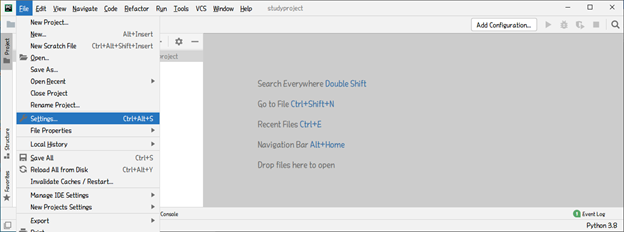

# Django

### Model

> 데이터 관리(DB)

### Template

> 사용자가 보는 화면(인터페이스)

### View

> 중간 관리자(상호 동작 - 기능)


## Django 프로젝트 만들기

개발 환경 : Window

### 가상 환경 만들기

```cmd
C:\jha> mkdir python_venv
C:\jha> cd python_venv
C:\jha\python_venv> python -m venv djangovenv	# djangovenv 라는 가상환경 생성
C:\jha\python_venv> dir	# 생성 확인
Volume in drive C has no label.
Volume Serial Number is *******

Directory of C:\jha\python_venv

07/23/2021  11:23 AM    <DIR>          .
07/23/2021  11:23 AM    <DIR>          ..
07/23/2021  11:23 AM    <DIR>          djangovenv
               0 File(s)              0 bytes
               3 Dir(s)  107,539,709,952 bytes free
```

### 가상 환경 활성화

```cmd
C:\jha\python_venv> cd djangovenv\Scripts
C:\jha\python_venv\djangovenv\Scripts> activate
(djangovenv)C:\jha\python_venv\djangovenv\Scripts>_
```

### 가상환경에 장고 개발 환경 설치

```cmd
(djangovenv)C:\jha\python_venv\djangovenv\Scripts> pip install django
"""장고 설치 과정............."""
"""WARNING: pip upgrade 관련 경고 뜨는 경우 아래 pip upgrade 실시 아니면 다음 과정을 넘어가도 됨"""
(djangovenv)C:\jha\python_venv\djangovenv\Scripts> python -m pip install --upgrade pip
"""pip upgrade 과정............."""
(djangovenv)C:\jha\python_venv\djangovenv\Scripts>_
```

### 장고 프로젝트 만들기

```cmd
(djangovenv)C:\jha\python_venv\djangovenv\Scripts> mkdir \jha\DJANGOexam	# 장고 프로젝트 만들 디렉토리 생성
(djangovenv)C:\jha\python_venv\djangovenv\Scripts> cd \jha\DJANGOexam
(djangovenv)C:\jha\DJANGOexam> django-admin startproject studyproject	# studyproject 이라는 main 프로젝트 생성
(djangovenv)C:\jha\DJANGOexam>_
```

### 장고 프로젝트 생성

```cmd
(djangovenv)C:\jha\DJANGOexam>cd studyproject
(djangovenv)C:\jha\DJANGOexam\studyproject> python manage.py runserver

```


http://localhost:8000/ 브라우저에서 접속


**성공!!**

> 서버 종료하고 싶으면 cmd 창에서 `ctrl+c` .


## 생성된 프로젝트 PyCharm과 연결

* PyCharm에서 "C:\jha\DJANGOexam\studyproject" 를 오픈

* 프로젝트 인터프리터 설정




아래 단에 terminal 선택! -> terminal 창 나옴


## 앱 생성

> PyCharm terminal 창에서 진행

```terminal
(djangovenv) C:\jha\DJANGOexam\studyproject> python manage.py startapp firstapp
(djangovenv) C:\jha\DJANGOexam\studyproject>
```


#### Main 프로젝트 - settings.py

> 전체 프로젝트 설정 관리
>
> * template을 이용한 url 이동을 할 경우 반드시 settings.py 에서 INSTALLED_APPS 에 app 추가해주기
>
>   ```python
>   INSTALLED_APPS = [
>       'secondapp',
>       ...,
>   ]
>   ```

#### Main 프로젝트 - urls.py

> 전역 url 관리(http://localhost:8000/...)

#### App - views.py

> 반응 관리??
> 요청에 따라 어떻게 반응할 것인지 관리

#### App - urls.py

> App 내 url 관리(http://localhost:8000/App/...)
>
> * Main 프로젝트에서 특정 App에 대하여 별도의 urls.py를 사용할 때
>
>   Main - urls.py path 에 include 를 사용하여 추가
>
>   ```python
>   from django.urls import path, include
>   
>   urlpatterns = [
>       ...
>       path('secondapp/', include('secondapp.urls')),   
>       # secondapp 사용시 secondapp.urls 를 끌어와 사용하겠다!!
>   ]
>   ```
>
> * Template 을 활용할 경우
>
>   templates 폴더를 생성하여 html 파일 관리!
>
>   `exam2.html`
>
>   ```html
>   <!DOCTYPE html>
>   <html lang="en">
>   <head>
>       <meta charset="UTF-8">
>       <title>Title</title>
>       <style>
>           span { color : blue }
>       </style>
>   </head>
>   <body>
>   <h1>당신의 이름은 <span>{{result}}</span>이군요~~~</h1>
>   </body>
>   </html>
>   ```
>
>   `secondapp\views.py`
>
>   ```python
>   from http import HttpResponse
>   def exam2(request) :
>       template = loader.get_template('exam2.html')
>       name = request.GET.get('name', 'JHA')	
>       # 쿼리문자열(? 뒤에 옴)에서 'name' 이라는 값에 대한 default 값을 JHA로 한다
>       context = {'result' : name}
>       return HttpResponse(template.render(context, request))
>   ```


#### [주요 file/directory 위치 정리]

**`urls.py`** : 프로젝트 폴더(메인)와 앱폴더(서브)

**`views.py`** : 앱폴더

**`templates\xxx.html`** : 앱폴더